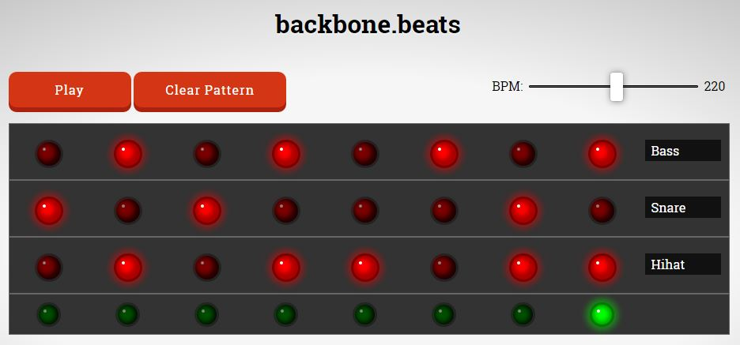

## backbone beats

[Demo here](http://unlikenesses.github.io/backbone-beats/).

Rudimentary drum machine made with [Backbone.js](http://backbonejs.org/).

For other Backbone audio experiments, see my [audio yo yo](https://github.com/unlikenesses/audio-yo-yo) and basic [audio interface](https://github.com/unlikenesses/backbone.audioInterface).

### Full list:

[Backbone.js version](https://github.com/unlikenesses/backbone-beats).

[React.js version](https://github.com/unlikenesses/react-beats).

[Angular.js 1.6 version](https://github.com/unlikenesses/angular-beats).

[Vue.js version](https://github.com/unlikenesses/vue-beats).

